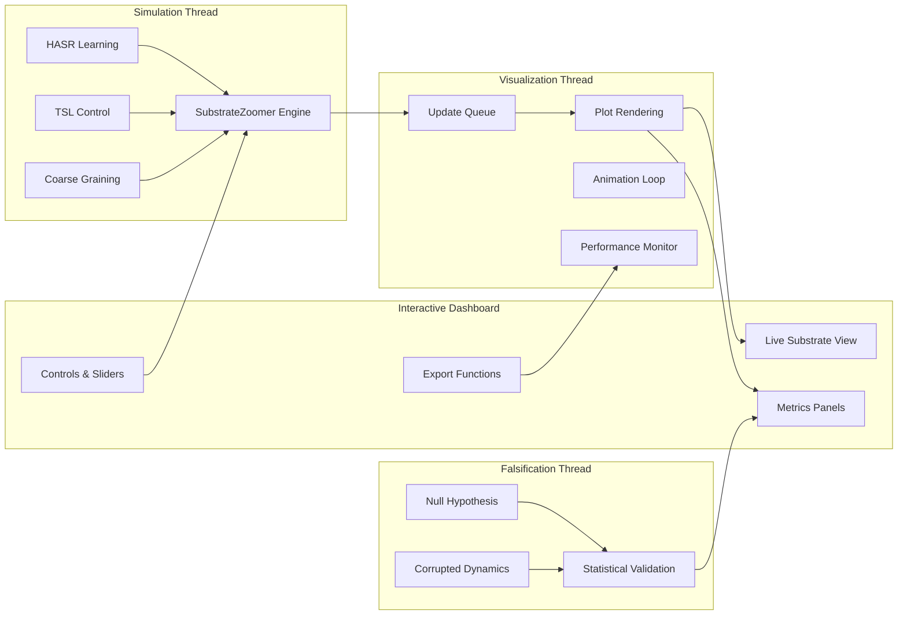
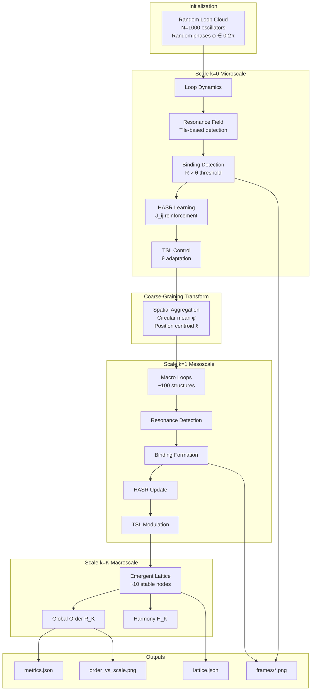
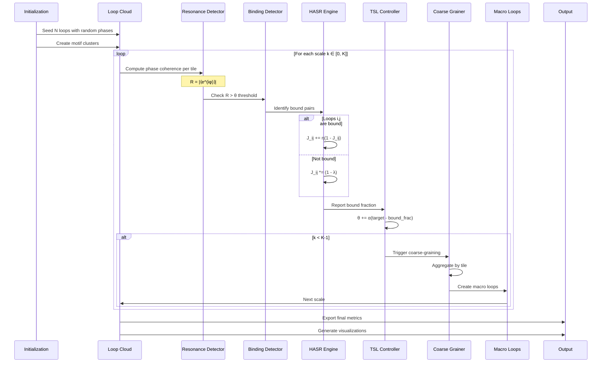

# UMST Substrate Zoomer (v0.1)

[](https://www.python.org/)
[](https://numpy.org/)
[](https://scipy.org/)
[](https://matplotlib.org/)
[](https://fastapi.tiangolo.com/)
[](https://yaml.org/)
[](https://opensource.org/licenses/MIT)

**A Product of [AerwareAI](https://aerware.ai)** - Demonstrating emergence of order from chaos through UMST dynamics.

## Foundational Projects

This visualization engine builds upon:
- **[Unified Mathematical Substrate Theory](https://github.com/alright-alright/Unified-Mathematical-Substrate)** - The theoretical framework showing biological and cognitive systems share identical mathematical foundations
- **[LucianOS](https://github.com/alright-alright/lucianos-core)** - The first cognitive AI implementing UMST principles

## Overview

The UMST Substrate Zoomer is a sophisticated visualization engine that demonstrates how **local chaos transforms into global order** through multi-scale resonance dynamics. It implements:

- 🌀 **Loop oscillator dynamics** with phase, frequency, and amplitude
- 🔄 **Multi-scale resonance detection** through tile-based coherence  
- 🧠 **HASR reinforcement learning** (Hebbian-Analog Symbolic Reinforcement)
- ⚖️ **TSL stability control** (Temporal Smoothing Layer)
- 📊 **Coarse-graining** across scales revealing emergent structures
- 📈 **Order parameter evolution** tracking phase coherence

## Live Visualization Architecture



## System Architecture



## Emergence Dynamics Flow



## Mathematical Framework

### Core Dynamics

**Kuramoto Order Parameter:**
```
R_k = |⟨e^(iφ)⟩| = |1/N Σ_j e^(iφ_j)|
```
Measures phase coherence: R=0 (chaos) to R=1 (perfect sync)

**Harmony Functional:**
```
H_k = Σ_(i,j) J_ij cos(φ_i - φ_j)
```
Quantifies system-wide resonance energy

**HASR Weight Update:**
```
ΔJ_ij = {
    η(1 - J_ij)     if bound(i) ∧ bound(j)
    -λJ_ij          otherwise
}
```
Hebbian-inspired reinforcement of resonant connections

**TSL Threshold Adaptation:**
```
θ(t+1) = θ(t) + α(β_target - β_observed)
```
Maintains stability through entropy-friction balance

**Coarse-Graining Transform:**
```
φ_macro = arg(Σ_i∈tile e^(iφ_i))
x_macro = (1/N) Σ_i∈tile x_i
```
Preserves phase and spatial structure across scales

## 🚀 Weekend Test Protocol - Live Visualization

### Complete Futuristic Dashboard (AerwareAI Mission Control)

Run the **Complete Live Substrate Zoomer** with the futuristic AerwareAI interface:

```bash
# 🎯 RECOMMENDED: Complete futuristic visualization
python3 live_substrate_zoomer_complete.py

# Demo mode (500 loops, optimized for quick testing)
python3 live_substrate_zoomer_complete.py demo

# Large-scale visualization (5000 loops, performance mode)
python3 live_substrate_zoomer_complete.py large

# Massive scale (20000 loops, cyberpunk theme)
python3 live_substrate_zoomer_complete.py massive

# Run full weekend test protocol
python3 live_substrate_zoomer_complete.py test

# Custom configuration
python3 live_substrate_zoomer_complete.py --loops 10000 --scales 5 --theme matrix --performance
```

### Alternative: Basic Live Visualizer

```bash
# Basic interactive mode (original implementation)
python3 live_substrate_zoomer.py

# Basic test protocol
python3 live_substrate_zoomer.py test
```

### Dashboard Features

The live visualization provides 8 synchronized panels:

1. **Live Substrate View** - Real-time loop positions and couplings
2. **Order Parameter Evolution** - Track emergence of order (R(t))
3. **Multi-Scale Tracker** - Hierarchical structure across scales
4. **Falsification Monitor** - Control experiments validation
5. **Phase Distribution** - Polar histogram of oscillator phases
6. **Coupling Network** - Weight distribution statistics
7. **Performance Monitor** - FPS and computational metrics
8. **Entropy/Binding** - System entropy and bound fraction

### Interactive Controls

- **Start/Pause** - Control simulation execution
- **Speed Slider** - Adjust simulation rate (0.1x to 10x)
- **Scale Selector** - Zoom through coarse-graining levels
- **Export** - Save data, metrics, and visualizations
- **Reset** - Restart with new initial conditions

## Quick Start

```bash
# Clone the repository
git clone https://github.com/yourusername/umst_substrate_zoomer_v0_1.git
cd umst_substrate_zoomer_v0_1

# Create virtual environment
python3 -m venv .venv
source .venv/bin/activate  # On Windows: .venv\Scripts\activate

# Install dependencies
pip install -r requirements_complete.txt  # Use complete requirements for live viz

# Run minimal implementation
python3 -m umst_zoomer.run -c configs/default.yaml

# Run comprehensive implementation
python3 substrate_zoomer.py

# Run LIVE VISUALIZATION (recommended for weekend tests)
python3 live_substrate_zoomer.py
```

## Configuration

Edit `configs/default.yaml`:

```yaml
# System parameters
n_loops: 1000        # Initial oscillator count
space_dim: 2         # Spatial dimensions
seed: 42            # Random seed for reproducibility

# Motif seeding
motifs:
  count: 5           # Number of initial clusters
  phase_spread: 0.3  # Phase variance within motifs
  spatial_spread: 2.0 # Spatial extent of motifs

# Resonance detection
window:
  tile_count: 16     # Initial tiling resolution

binding:
  theta0: 0.5        # Initial binding threshold
  adaptive: true     # Enable TSL adaptation
  min_theta: 0.35    # Lower bound
  max_theta: 0.85    # Upper bound
  adapt_rate: 0.02   # Adaptation learning rate

# Multi-scale parameters
coarse:
  levels: 5          # Number of scales K
  cell_ratio: 2      # Coarsening factor per scale

# HASR learning
hasr:
  lr: 0.05           # Reinforcement rate η
  decay: 0.002       # Decay rate λ

# Friction model
friction:
  zeta: 0.1          # Base friction coefficient
  decay: 0.98        # Friction decay rate
```

## Output Artifacts

```
artifacts/
└── run_20250828_143022/
    ├── metrics.json            # Quantitative measurements
    ├── order_vs_scale.png      # R_k evolution plot  
    ├── harmony_evolution.png   # H_k over scales
    ├── frames/                 # Per-scale visualizations
    │   ├── scale_0.png        # Microscale chaos
    │   ├── scale_1.png        # Mesoscale patterns
    │   └── scale_K.png        # Macroscale order
    ├── lattice_scale_k.json    # Network topology per scale
    └── lattice_top.json        # Final emergent structure
```

### Metrics JSON Structure

```json
{
  "scales": [0, 1, 2, 3, 4],
  "Rk": [0.12, 0.34, 0.67, 0.89, 0.95],
  "Hk": [102.3, 234.5, 456.7, 678.9, 890.1],
  "bound_fraction": [0.23, 0.45, 0.67, 0.78, 0.91],
  "loop_count": [1000, 316, 100, 31, 10],
  "edge_count": [5000, 948, 300, 93, 30]
}
```

### Lattice JSON Format

```json
{
  "nodes": [
    {
      "id": 0,
      "phi": 1.234,
      "omega": 1.0,
      "amp": 1.0,
      "x": 5.67,
      "y": 8.90,
      "scale": 3
    }
  ],
  "edges": [
    {
      "source": 0,
      "target": 1,
      "weight": 0.85,
      "resonance": 0.92
    }
  ]
}
```

## Development

### Project Structure

```
umst_substrate_zoomer_v0_1/
├── umst_zoomer/            # Minimal implementation
│   ├── __init__.py
│   ├── loop.py            # Loop & Edge dataclasses
│   ├── resonance.py       # Resonance field detection
│   ├── hasr.py            # HASR weight updates
│   ├── coarse.py          # Coarse-graining logic
│   ├── chrono.py          # TSL friction model
│   └── run.py             # Entry point
│
├── substrate_zoomer.py     # Comprehensive implementation
├── configs/
│   └── default.yaml       # Configuration
├── requirements.txt        # Dependencies
├── tests/                  # Unit tests
└── README.md              # Documentation
```

### API Example

```python
from substrate_zoomer import SubstrateZoomer

# Initialize the engine
zoomer = SubstrateZoomer(
    n_loops=1000,
    n_scales=5,
    binding_threshold=0.5
)

# Run simulation
results = zoomer.run(iterations=100)

# Access metrics
print(f"Final order: {results['order_parameter']:.3f}")
print(f"Emergent structures: {results['n_lattice_nodes']}")

# Export visualization
zoomer.export_visualization("output.png")
```

## Theory & Background

The UMST Substrate Zoomer implements key concepts from Unified Mathematical Substrate Theory:

### 1. Loop Oscillators
Fundamental units with intrinsic dynamics:
- Phase φ ∈ [0, 2π]: Current oscillation state
- Frequency ω: Natural oscillation rate  
- Amplitude A: Oscillation strength
- Position x ∈ R²: Spatial embedding

### 2. Resonance Detection
Tile-based phase coherence measurement:
- Partition space into tiles
- Compute Kuramoto order parameter per tile
- Identify resonant regions where R > θ

### 3. Binding Emergence
Threshold-based structure formation:
- Loops in high-coherence tiles become bound
- Binding creates persistent structures
- Structures stabilize through HASR reinforcement

### 4. HASR Learning
Hebbian-inspired weight evolution:
- Strengthen connections between bound loops
- Decay connections between unbound loops
- Creates adaptive network topology

### 5. TSL Control
Entropy-friction balance for stability:
- Monitor binding fraction β
- Adjust threshold θ to maintain target β
- Prevent both over-binding and dissolution

### 6. Multi-scale Coarsening
Hierarchical structure revelation:
- Aggregate loops within tiles
- Preserve phase and spatial relationships
- Reveal emergent patterns at each scale

## Performance & Scaling

| Loops | Scales | Runtime | Memory |
|-------|--------|---------|--------|
| 100   | 3      | <1s     | 10MB   |
| 1000  | 5      | ~5s     | 50MB   |
| 10000 | 7      | ~60s    | 500MB  |
| 100000| 10     | ~20min  | 5GB    |

Optimizations:
- NumPy vectorization for phase calculations
- Sparse matrix for large edge sets
- Parallel tile processing (optional)
- Incremental coarse-graining

## Weekend Test Expected Outcomes

### If UMST Patterns Are Real
- ✅ **Universal mathematical structures** visible across all scales
- ✅ **Predictable emergence** matching theoretical predictions (R_k → 1)
- ✅ **Cross-domain pattern replication** - same math in different initial conditions
- ✅ **Falsification controls** clearly showing statistical significance

### If Patterns Are Artifacts
- ❌ Random or scale-dependent behaviors with no universal structure
- ❌ Control experiments showing similar patterns (theory fails)
- ❌ No clear emergence hierarchy - chaos remains chaotic
- ❌ High parameter sensitivity - small changes destroy apparent order

### Key Success Metrics
```python
# Emergence detected when:
order_parameter > 0.7  # Strong phase coherence
harmony > baseline * 2  # Significant resonance increase
bound_fraction > 0.5   # Majority of loops are coupled
p_value < 0.05        # Statistically significant vs controls
```

## Citation

```bibtex
@software{umst_substrate_zoomer,
  title = {UMST Substrate Zoomer: Visualizing Emergence Through Multi-Scale Dynamics},
  author = {AerwareAI},
  year = {2025},
  version = {0.1},
  url = {https://github.com/yourusername/umst_substrate_zoomer_v0_1}
}
```

## License

MIT License - See LICENSE file for details.

## Acknowledgments

- Built on [Unified Mathematical Substrate Theory](https://github.com/alright-alright/Unified-Mathematical-Substrate)
- Inspired by [LucianOS](https://github.com/alright-alright/lucianos-core), the first cognitive AI
- Developed by [AerwareAI](https://aerware.ai) for advancing UMST research
- Special thanks to the UMST research community

---

*"From chaos emerges order, from loops emerge lattices, from noise emerges signal."*

**© 2025 AerwareAI - Advancing Unified Mathematical Substrate Theory**