# UMST Substrate Zoomer (v0.1)

[](https://www.python.org/)
[](https://numpy.org/)
[](https://scipy.org/)
[](https://matplotlib.org/)
[](https://fastapi.tiangolo.com/)
[](https://yaml.org/)
[](https://opensource.org/licenses/MIT)

**A Product of [AerwareAI](https://aerware.ai)** - Demonstrating emergence of order from chaos through UMST dynamics.

## Foundational Projects

This visualization engine builds upon:
- **[Unified Mathematical Substrate Theory](https://github.com/alright-alright/Unified-Mathematical-Substrate)** - The theoretical framework showing biological and cognitive systems share identical mathematical foundations
- **[LucianOS](https://github.com/alright-alright/lucianos-core)** - The first cognitive AI implementing UMST principles

## Overview

The UMST Substrate Zoomer is a sophisticated visualization engine that demonstrates how **local chaos transforms into global order** through multi-scale resonance dynamics. It implements:

- 🌀 **Loop oscillator dynamics** with phase, frequency, and amplitude
- 🔄 **Multi-scale resonance detection** through tile-based coherence  
- 🧠 **HASR reinforcement learning** (Hebbian-Analog Symbolic Reinforcement)
- ⚖️ **TSL stability control** (Temporal Smoothing Layer)
- 📊 **Coarse-graining** across scales revealing emergent structures
- 📈 **Order parameter evolution** tracking phase coherence

## System Architecture

```mermaid
graph TB
    subgraph Init[Initialization]
        IN[Random Loop Cloud<br/>N=1000 oscillators<br/>Random phases φ ∈ 0-2π]
    end
    
    subgraph Scale0[Scale k=0 Microscale]
        L0[Loop Dynamics]
        R0[Resonance Field<br/>Tile-based detection]
        B0[Binding Detection<br/>R > θ threshold]
        H0[HASR Learning<br/>J_ij reinforcement]
        T0[TSL Control<br/>θ adaptation]
    end
    
    subgraph Transform[Coarse-Graining Transform]
        CG[Spatial Aggregation<br/>Circular mean φ̄<br/>Position centroid x̄]
    end
    
    subgraph Scale1[Scale k=1 Mesoscale]
        L1[Macro Loops<br/>~100 structures]
        R1[Resonance Detection]
        B1[Binding Formation]
        H1[HASR Update]
        T1[TSL Modulation]
    end
    
    subgraph ScaleK[Scale k=K Macroscale]
        LK[Emergent Lattice<br/>~10 stable nodes]
        RK[Global Order R_K]
        HK[Harmony H_K]
    end
    
    subgraph Output[Outputs]
        M[metrics.json]
        P[order_vs_scale.png]
        F[frames/*.png]
        LAT[lattice.json]
    end
    
    IN --> L0
    L0 --> R0 --> B0
    B0 --> H0 --> T0
    T0 --> CG
    CG --> L1
    L1 --> R1 --> B1
    B1 --> H1 --> T1
    T1 --> LK
    LK --> RK
    LK --> HK
    
    RK --> M
    RK --> P
    B0 --> F
    B1 --> F
    LK --> LAT
```



## Emergence Dynamics Flow

```mermaid
sequenceDiagram
    participant Init as Initialization
    participant LC as Loop Cloud
    participant RD as Resonance Detector
    participant BD as Binding Detector
    participant HASR as HASR Engine
    participant TSL as TSL Controller
    participant CG as Coarse Grainer
    participant ML as Macro Loops
    participant Out as Output
    
    Init->>LC: Seed N loops with random phases
    Init->>LC: Create motif clusters
    
    loop For each scale k ∈ [0, K]
        LC->>RD: Compute phase coherence per tile
        Note over RD: R = |⟨e^(iφ)⟩|
        RD->>BD: Check R > θ threshold
        BD->>HASR: Identify bound pairs
        
        alt Loops i,j are bound
            HASR->>HASR: J_ij += η(1 - J_ij)
        else Not bound
            HASR->>HASR: J_ij *= (1 - λ)
        end
        
        HASR->>TSL: Report bound fraction
        TSL->>TSL: θ += α(target - bound_frac)
        
        alt k < K-1
            TSL->>CG: Trigger coarse-graining
            CG->>CG: Aggregate by tile
            CG->>ML: Create macro loops
            ML->>LC: Next scale
        end
    end
    
    LC->>Out: Export final metrics
    LC->>Out: Generate visualizations
```



## Mathematical Framework

### Core Dynamics

**Kuramoto Order Parameter:**
```
R_k = |⟨e^(iφ)⟩| = |1/N Σ_j e^(iφ_j)|
```
Measures phase coherence: R=0 (chaos) to R=1 (perfect sync)

**Harmony Functional:**
```
H_k = Σ_(i,j) J_ij cos(φ_i - φ_j)
```
Quantifies system-wide resonance energy

**HASR Weight Update:**
```
ΔJ_ij = {
    η(1 - J_ij)     if bound(i) ∧ bound(j)
    -λJ_ij          otherwise
}
```
Hebbian-inspired reinforcement of resonant connections

**TSL Threshold Adaptation:**
```
θ(t+1) = θ(t) + α(β_target - β_observed)
```
Maintains stability through entropy-friction balance

**Coarse-Graining Transform:**
```
φ_macro = arg(Σ_i∈tile e^(iφ_i))
x_macro = (1/N) Σ_i∈tile x_i
```
Preserves phase and spatial structure across scales

## Quick Start

```bash
# Clone the repository
git clone https://github.com/yourusername/umst_substrate_zoomer_v0_1.git
cd umst_substrate_zoomer_v0_1

# Create virtual environment
python3 -m venv .venv
source .venv/bin/activate  # On Windows: .venv\Scripts\activate

# Install dependencies
pip install -r requirements.txt

# Run minimal implementation
python3 -m umst_zoomer.run -c configs/default.yaml

# Run comprehensive implementation
python3 substrate_zoomer.py
```

## Configuration

Edit `configs/default.yaml`:

```yaml
# System parameters
n_loops: 1000        # Initial oscillator count
space_dim: 2         # Spatial dimensions
seed: 42            # Random seed for reproducibility

# Motif seeding
motifs:
  count: 5           # Number of initial clusters
  phase_spread: 0.3  # Phase variance within motifs
  spatial_spread: 2.0 # Spatial extent of motifs

# Resonance detection
window:
  tile_count: 16     # Initial tiling resolution

binding:
  theta0: 0.5        # Initial binding threshold
  adaptive: true     # Enable TSL adaptation
  min_theta: 0.35    # Lower bound
  max_theta: 0.85    # Upper bound
  adapt_rate: 0.02   # Adaptation learning rate

# Multi-scale parameters
coarse:
  levels: 5          # Number of scales K
  cell_ratio: 2      # Coarsening factor per scale

# HASR learning
hasr:
  lr: 0.05           # Reinforcement rate η
  decay: 0.002       # Decay rate λ

# Friction model
friction:
  zeta: 0.1          # Base friction coefficient
  decay: 0.98        # Friction decay rate
```

## Output Artifacts

```
artifacts/
└── run_20250828_143022/
    ├── metrics.json            # Quantitative measurements
    ├── order_vs_scale.png      # R_k evolution plot  
    ├── harmony_evolution.png   # H_k over scales
    ├── frames/                 # Per-scale visualizations
    │   ├── scale_0.png        # Microscale chaos
    │   ├── scale_1.png        # Mesoscale patterns
    │   └── scale_K.png        # Macroscale order
    ├── lattice_scale_k.json    # Network topology per scale
    └── lattice_top.json        # Final emergent structure
```

### Metrics JSON Structure

```json
{
  "scales": [0, 1, 2, 3, 4],
  "Rk": [0.12, 0.34, 0.67, 0.89, 0.95],
  "Hk": [102.3, 234.5, 456.7, 678.9, 890.1],
  "bound_fraction": [0.23, 0.45, 0.67, 0.78, 0.91],
  "loop_count": [1000, 316, 100, 31, 10],
  "edge_count": [5000, 948, 300, 93, 30]
}
```

### Lattice JSON Format

```json
{
  "nodes": [
    {
      "id": 0,
      "phi": 1.234,
      "omega": 1.0,
      "amp": 1.0,
      "x": 5.67,
      "y": 8.90,
      "scale": 3
    }
  ],
  "edges": [
    {
      "source": 0,
      "target": 1,
      "weight": 0.85,
      "resonance": 0.92
    }
  ]
}
```

## Development

### Project Structure

```
umst_substrate_zoomer_v0_1/
├── umst_zoomer/            # Minimal implementation
│   ├── __init__.py
│   ├── loop.py            # Loop & Edge dataclasses
│   ├── resonance.py       # Resonance field detection
│   ├── hasr.py            # HASR weight updates
│   ├── coarse.py          # Coarse-graining logic
│   ├── chrono.py          # TSL friction model
│   └── run.py             # Entry point
│
├── substrate_zoomer.py     # Comprehensive implementation
├── configs/
│   └── default.yaml       # Configuration
├── requirements.txt        # Dependencies
├── tests/                  # Unit tests
└── README.md              # Documentation
```

### API Example

```python
from substrate_zoomer import SubstrateZoomer

# Initialize the engine
zoomer = SubstrateZoomer(
    n_loops=1000,
    n_scales=5,
    binding_threshold=0.5
)

# Run simulation
results = zoomer.run(iterations=100)

# Access metrics
print(f"Final order: {results['order_parameter']:.3f}")
print(f"Emergent structures: {results['n_lattice_nodes']}")

# Export visualization
zoomer.export_visualization("output.png")
```

## Theory & Background

The UMST Substrate Zoomer implements key concepts from Unified Mathematical Substrate Theory:

### 1. Loop Oscillators
Fundamental units with intrinsic dynamics:
- Phase φ ∈ [0, 2π]: Current oscillation state
- Frequency ω: Natural oscillation rate  
- Amplitude A: Oscillation strength
- Position x ∈ R²: Spatial embedding

### 2. Resonance Detection
Tile-based phase coherence measurement:
- Partition space into tiles
- Compute Kuramoto order parameter per tile
- Identify resonant regions where R > θ

### 3. Binding Emergence
Threshold-based structure formation:
- Loops in high-coherence tiles become bound
- Binding creates persistent structures
- Structures stabilize through HASR reinforcement

### 4. HASR Learning
Hebbian-inspired weight evolution:
- Strengthen connections between bound loops
- Decay connections between unbound loops
- Creates adaptive network topology

### 5. TSL Control
Entropy-friction balance for stability:
- Monitor binding fraction β
- Adjust threshold θ to maintain target β
- Prevent both over-binding and dissolution

### 6. Multi-scale Coarsening
Hierarchical structure revelation:
- Aggregate loops within tiles
- Preserve phase and spatial relationships
- Reveal emergent patterns at each scale

## Performance & Scaling

| Loops | Scales | Runtime | Memory |
|-------|--------|---------|--------|
| 100   | 3      | <1s     | 10MB   |
| 1000  | 5      | ~5s     | 50MB   |
| 10000 | 7      | ~60s    | 500MB  |
| 100000| 10     | ~20min  | 5GB    |

Optimizations:
- NumPy vectorization for phase calculations
- Sparse matrix for large edge sets
- Parallel tile processing (optional)
- Incremental coarse-graining

## Citation

```bibtex
@software{umst_substrate_zoomer,
  title = {UMST Substrate Zoomer: Visualizing Emergence Through Multi-Scale Dynamics},
  author = {AerwareAI},
  year = {2025},
  version = {0.1},
  url = {https://github.com/yourusername/umst_substrate_zoomer_v0_1}
}
```

## License

MIT License - See LICENSE file for details.

## Acknowledgments

- Built on [Unified Mathematical Substrate Theory](https://github.com/alright-alright/Unified-Mathematical-Substrate)
- Inspired by [LucianOS](https://github.com/alright-alright/lucianos-core), the first cognitive AI
- Developed by [AerwareAI](https://aerware.ai) for advancing UMST research
- Special thanks to the UMST research community

---

*"From chaos emerges order, from loops emerge lattices, from noise emerges signal."*

**© 2025 AerwareAI - Advancing Unified Mathematical Substrate Theory**